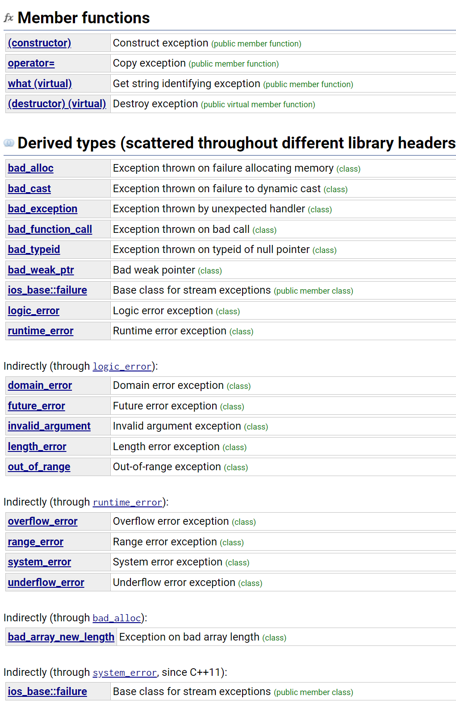

#c++中的异常处理
## try..catch
我们可以借助 C++ 异常机制来捕获上面的异常，避免程序崩溃。捕获异常的语法为：

```c++
try{
    // 可能抛出异常的语句 例如：
    throw "Unknown Exception";  //抛出异常
}catch(exceptionType variable){
    // 处理异常的语句
}
```
## 简单的异常场景
throw抛出一个异常类型，cath通过判断是否符合后走进去。

```c++
#include <iostream>
#include <exception>
using namespace std;
 
struct MyException : public exception
{
  const char * what () const throw ()
  {
    return "C++ Exception";
  }
};

int main()
{
  try
  {
    throw MyException();
  }
  catch(MyException& e)
  {
    std::cout << "MyException caught" << std::endl;
    std::cout << e.what() << std::endl;
  }
  catch(std::exception& e)
  {
    //其他的错误
  }
}

```


## 将对象用作异常类型
通过判断对象的类型决定抛出哪个异常。
```c++
// exception constructor
#include <iostream>       // std::cout
#include <exception>      // std::exception

struct ooops : std::exception {
  const char* what() const noexcept {return "Ooops!\n";}
};

int main () {
  ooops e;
  std::exception* p = &e;
  try {
      throw e;       // throwing copy-constructs: ooops(e)
  } catch (std::exception& ex) {
      std::cout << ex.what();
  }
  try {
      throw *p;      // throwing copy-constructs: std::exception(*p)
  } catch (std::exception& ex) {
      std::cout << ex.what();
  }
  return 0;
}
```

## std::exception
在c++11中，exception类被定义为

```c++
class exception {
public:
  exception () noexcept;
  exception (const exception&) noexcept;
  exception& operator= (const exception&) noexcept;
  virtual ~exception();
  virtual const char* what() const noexcept;
}
```
exceptions中存在一些异常判断的函数可以用作异常处理


具体函数


[详情见cplusplus](https://cplusplus.com/reference/exception/exception/)