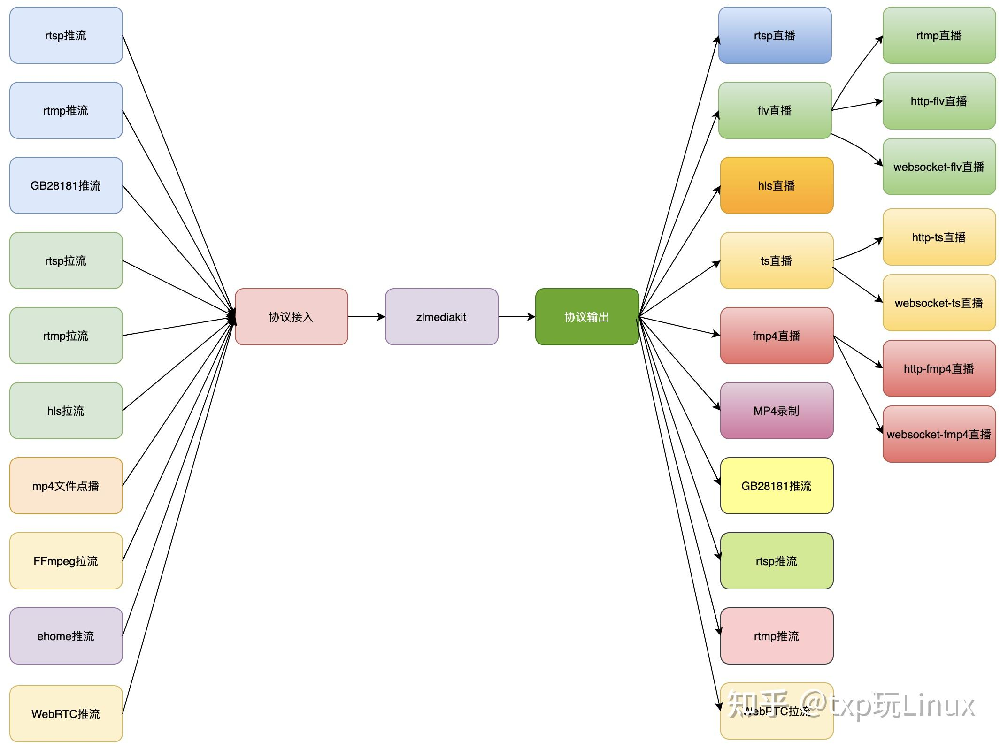

## 服务器搭建

github网址
``` 
https://github.com/xia-chu/ZLMediaKit
``` 
在官网的wiki教程中有详细的介绍：

````shell
https://github.com/xia-chu/ZLMediaKit/wiki/%E5%BF%AB%E9%80%9F%E5%BC%80%E5%A7%8B
````


## 源码下载及编译
官网的编译教程很全

```
https://github.com/ZLMediaKit/ZLMediaKit/wiki/%E5%BF%AB%E9%80%9F%E5%BC%80%E5%A7%8B
```
下面针对ubuntu18.04进行

#国内用户推荐从同步镜像网站gitee下载 

```shell
git clone --depth 1 https://gitee.com/xia-chu/ZLMediaKit
cd ZLMediaKit
#千万不要忘记执行这句命令
git submodule update --init
```
#编译器安装
```shell
sudo apt-get install build-essential
#没有cmake安装一下cmake
cmake --version //查看一线cmake是否安装及版本信息
sudo apt-get install cmake
#安装依赖库
##除了openssl,其他其实都可以不安装
sudo apt-get install libssl-dev -y;
sudo apt-get install libsdl-dev -y;
sudo apt-get install libavcodec-dev -y;
sudo apt-get install libavutil-dev -y;
sudo apt-get install ffmpeg -y;
```

#构建可执行文件
```shell
cd ZLMediaKit
mkdir build
cd build
cmake ..
make -j4
````

## zlmediakit程序运行
```shell
cd ZLMediaKit/release/linux/Debug
#通过-h可以了解启动参数
./MediaServer -h
#以守护进程模式启动
./MediaServer -d &
#我的ubunt需要sudo权限，另外加了&后会没有打印，具体我的执行是：
sudo ./MediaServer -d

```
## 使用ffmpeg推流
```shell
ffmpeg -re -i f/home/yang/vmshare/opensrchub/ZLMediaKit/www/record/fade.mp4 -f rtsp -rtsp_transport tcp rtsp://172.93.46.6/live/test
```
## 使用ffplay本地播放
```shell
ffplay -rtsp_transport tcp rtsp://172.93.46.6/live/test
```
## c api sdk
头文件在`ZLMediaKit/api/include`
```shell
ZLMediaKit/release/linux/Debug/libmk_api.so
```

## ZLMediaKit的工作原理

