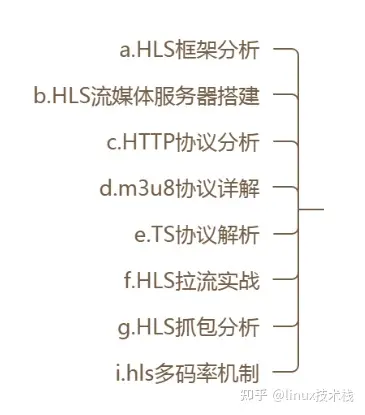
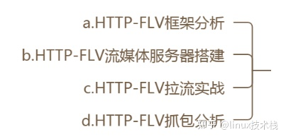
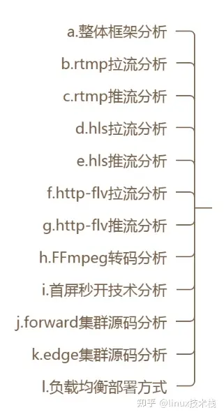
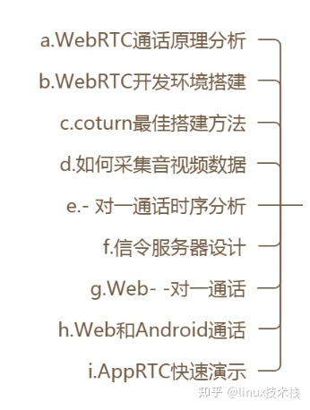
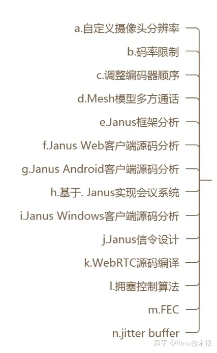
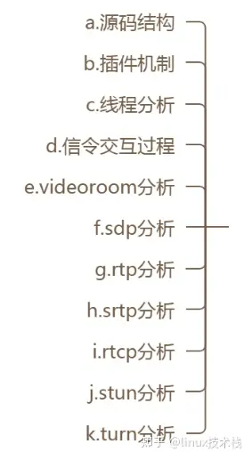

#流媒体

## 流媒体技能树
## 音视频基础知识

## 流媒体传输协议
### RTMP 
知识结构体：
* RTMP框架分析
* RTMP流媒体服务器搭建
* RTMP协议详解
* H264封装
* AAC封装
* RTMP推流实战
* RTMP拉流实战
* RTMP抓包分析

#### 什么是RTMP
* RTMP（Real Time Messaging Protocol）即“实时消息传送协议”，
* RTMP是一种基于TCP的协议，通过建立持久的连接来传输数据，具有低延迟和高可靠性的特点。
* RTMP通常用于实时流媒体应用，例如在线直播、视频会议和实时通信。它支持单向流（单向数据推送，如直播）和双向流（双向数据通信，如视频会议）。
RTMP协议中，服务端和客户端之间通过TCP协议发送数据。
### RTSP 
* HTTP-FLV框架分析
* RTP协议分析
* RTCP协议分析
* RTSP流媒体服务器搭建
* RTSP协议分析
* RTSP推流实战
* RTSP拉流实战
* RTSP抓包分析
* wireshark抓包分析
* RTSP流媒体服务器分析
#### 什么是RTSP
RTSP（Real Time Streaming Protocol）即“实时流传输协议”，是用于在IP网络（HTTP、RTMP、RTP）上进行音视频和数据流媒体的数据传输协议。
####RTSP与RTMP的区别
RTMP协议是Adobe公司自家的协议，RTSP是国际标准化组织（ISO）和国际电信联盟（ITU）为视频、音频、数据流媒体定义的协议。
RTSP协议是应用层协议，RTMP协议是传输层协议。 
RTSP协议基于TCP协议，RTMP协议基于UDP协议。
RTSP协议基于文本协议，RTMP协议基于二进制协议。
RTSP协议基于请求响应模式，RTMP协议基于主动推送模式。
#### RTSP与RTMP在应用场景上的区别
RTSP协议主要用于视频点播（VOD）场景，RTMP协议主要用于视频直播（VOD）场景。
RTSP协议主要用于视频点播场景，RTMP协议主要用于视频直播场景。

### HLS 

### HTTP-FLV 

## 常用的流媒体服务框架
### SRS

### WEBRTC

### Janus
