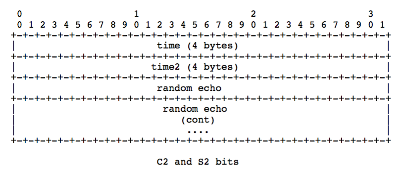

# rtmp协议详解

## 前言

国内常见的直播协议有几个：RTMP、HLS、HTTP-FLV。

## 1.什么是rtmp协议？
**RTMP，全称 Real Time Messaging Protocol，即实时消息传送协议**。Adobe 公司为 Flash 播放器和服务器之间音视频数据传输开发的私有协议。
工作在 TCP 之上的明文协议，默认使用端口 1935。
协议中的基本数据单元成为消息（Message），传输的过程中消息会被拆分为更小的消息块（Chunk）单元。最后将分割后的消息块通过 TCP 协议传输，接收端再反解接收的消息块恢复成流媒体数据。

使用rtmp协议实现客户端和server端的连接及播放的流程如下：

## 2. rtmp协议是如何建立的
RTMP协议的连接过程分为握手和建立连接两个阶段。

### 2.1 RTMP 握手（Handshake）：
#### 流程

* ***C0和S0***： 
    **1. 客户端发起** 首先发送一个字节的 C0 数据，表明它支持的 RTMP 版本。
    **2. 服务器响应** 在收到 C0 后，立即响应一个字节的 S0 数据，也表明它支持的 RTMP 版本。
    * _（**字节通常是握手协议的版本号**，例如 RTMP v3 使用字节 0x03）_
* ***C1和S1：*** (握手过程的关键部分)
    **1. 客户端发起**在 C1 阶段发送包含时间戳和随机数据的 1536 字节的 C1 数据块。
    **2. 服务器响应**收到 C1 后，立即响应一个相同大小的 S1 数据块，也包含时间戳和随机数据。
    * _(这些数据块用于生成共享密钥，用于后续的通信加密)_
* ***C2和S2：*** 握手的最后阶段。客户端（C2）和服务器（S2）分别发送与之前的随机数据相同的 1536 字节数据块。这个阶段是为了确认共享密钥的生成。

**在实际工程应用中，一般是客户端先将C0, C1块同时发出，服务器在收到C1 之后同时将S0, S1, S2发给客户端。之后客户端向服务器端发送C2块，简单握手完成**

#### 握手过程的数据解析

##### C0和S0的数据内容

CO和S0占用一个字节，8bit，通常为0x03，表示当前版本为3.0 目前有0, 1, 2, 3 四个版本, 但目前仅3为有效版本
如果是0x03，则对应的比特位是：

##### C1和S1的数据内容

C1和S1数据包长度固定为1536字节。

##### C2和S2的数据内容

**C2和S2**其长度也固定为1536字节, 其中Time为C1/S1中的时间. 随机数回应(Random Echo)这一字段包含接收到C1/S1阶段的随机数.

### 2.2 建立网络连接
**连接建立：** 完成握手后，客户端和服务器之间的连接被视为建立。连接过程包括在握手之后，通过同步的时间戳，确保客户端和服务器处于相同的时间轴上。

* 客户端发送命令消息中的“连接”(connect)到服务器，请求与一个服务应用实例建立连接。

* 服务器接收到连接命令消息后，发送确认窗口大小(Window Acknowledgement Size)协议消息到客户端，同时连接到连接命令中提到的应用程序。

* 服务器发送设置带宽协议消息到客户端。

* 客户端处理设置带宽协议消息后，发送确认窗口大小(Window Acknowledgement Size)协议消息到服务器端。

* 服务端向客户端发送“流开始”（Stream Begin）。

* 服务器发送命令消息中的“结果”(_result)，通知客户端连接的状态。

在连接建立后，客户端和服务器可以通过发送消息设置每个数据块的大小（Chunk Size）。这有助于实现流控制和提高连接的灵活性。

### 2.3 建立网络流（Create Stream）：

* 客户端发送命令消息中的“创建流”（CreateStream）命令到服务器端。
* 服务器端接收到“创建流”命令后，发送命令消息中的“结果”(_result)，通知客户端流的状态。

### 2.4 播放

* 客户端发送命令“播放”给服务器
* 接收到播放命令后，服务器发送设置块大小（ChunkSize）协议消息给客户端
* 服务器发送“stream begin”给客户端，告诉客户端流的id
* 播放命令成功的话，服务器发送命令消息中的“响应状态” NetStream.Play.Start & NetStream.Play.Reset，告知客户端“播放”命令执行成功
* 服务器发送客户端要播放的音频和视频数据

## rtmp协议是如何传输数据的？
### rtmp消息的报文结构

消息头包含以下：

* **Message Type** 消息类型（1-Byte）：类型 ID 1 - 6 被保留用于协议控制消息。
* **PayLoad length**（3-Bytes）：表示有效负载的字节数。以大端格式保存。
* **Timestamp** 消息时间戳（4-Bytes）：包含了当前消息的 timestamp。以大端格式保存。
* **Message Stream Id** 消息流（3-Bytes）：消息归属消息流 ID 标志位。以大端格式保存。

#### Message Type
Message Type 有Chunk header中的Message Type ID字段确定.

##### 当Message Type ID为4时
作为用户控制消息. 该消息携带事件类型和事件数据两部分. 其格式如下图

|事件类型 & Event Type|描述|
|---|---|
|流开始 = 0 |	服务端发送该事件, 用来通知客户端一个流已经可以用来通讯了. 默认情况下, 该事件是在收到客户端连接指令并成功处理后发送的第一个事件. 事件的数据使用4个字节来表示可用的流的ID|
|流结束 = 1	|服务端发送该事件, 用来通知客户端其在流中请求的回放数据已经结束了. 如果没有额外的指令, 将不会再发送任何数据, 而客户端会丢弃之后从该流接收到的消息. 事件数据使用4个字节来表示回放完成的流的ID|
|流枯竭 = 2	|服务端发送该事件, 用来通知客户端流中已经没有更多的数据了. 如果服务端在一定时间后没有探测到更多数据, 它就可以通知所有订阅该流的客户端, 流已经枯竭. 事件数据用4个字节来表示枯竭的流的ID|
|设置缓冲区大小 = 3	|客户端发送该事件, 用来告知服务端用来缓存流中数据的缓冲区大小(单位毫秒). 该事件在服务端开始处理流数据之前发送. 事件数据中, 前4个字节用来表示流ID, 之后的4个字节用来表示缓冲区大小（单位毫秒).|
|流已录制 = 4	|服务端发送该事件, 用来通知客户端指定流是一个录制流. 事件数据用4个字节表示录制流的ID|
|ping请求 = 6	|服务端发送该事件, 用来探测客户端是否处于可达状态. 事件数据是一个4字节的时间戳, 表示服务端分发该事件时的服务器本地时间. 客户端收到后用ping响应回复服务端|
|ping响应 = 7	|客户端用该事件回复服务端的ping请求, 事件数据为收到的ping请求中携带的4字节的时间戳.|

##### 当Message Type ID为15/18时
作为数据消息. 15表示AMF3编码, 18表示AMF0编码. 通过该消息发送元数据和其他用户数据元数据包括数据(音频、视频)的创建时间、时长、主题等详细信息

##### 当Message Type ID为16/19时
作为共享对象消息. 16表示AMF3编码, 19表示AMF0编码. 注: 共享对象是一个在多个客户端、示例之间进行同步的Flash对象(键值对集合). Flash已经废弃这里不再描述

##### 当Message Type ID为20/17时
作为指令消息. 17表示AMF3编码, 20表示AMF0编码. 发送这些消息来完成连接、创建流、发布、播放、暂停等操作
#####当Message Type ID为22时
作为组合消. 其格式如下：
##### 当Message Type ID为8时
表示音频消息

##### 当Message Type ID为9时
表示视频消息

#### Payload
Message Payload本身并不是RTMP协议标准种的内容, 但作为还原的一部分. 这里额外写入.

上面主要介绍了Message Header的组成，除去msg header后面跟的是msgbody，而每一个msgbody又分为多个小的chunk，这样每一个分成最小的chunk即消息块。下面来了解一下消息块的组成。

### rtmp消息块的组成
RTMP 协议是以分组形式传送数据包。一条报文可以被分为Chunk Stream部分和Message Stream部分，如上图所示。
#### Chunk Stream
一个完整的Chunk Stream数据块包含两个部分：Chunk Header 和 Chunk Data，这两者组合在一起，构成了一个有效的消息类型，结构如下：

基础数据头（Basic Header）：保存 CS ID、Chunk Type（决定 Msg Header 类型）
消息数据头（Message Header）：包含被发送消息的相关信息，类型Chunk Type决定
扩展时间戳（Extended Timestamp）（32-bits）：消息头携带的时间戳扩展位

下面我们来一一解释一下写数据端的内容：

##### Basic Header

Basic Header: 1-3个字节, 该长度取决于Chunk Stream ID. Chunk Stream ID是一个变长的字段. 其有三种结构：
2-7bit数据为1时Basic Header长度为3字节
当2-7bit数据为0, Basic Header长度为2字节
其余情况Basic Header长度为1字节.
下图为三种情况：

其中的fmt字段表示消息头的长度，取值范围是0-3。
通俗的讲就是如果2-7不设置为全0或者全1，那么Basic Header的长度就是1字节，当前2-7的比特值就是CSid范围是2-63，如果设置成全0或全1,则为64-319或者64-63399
##### Message Header
Message Header: 11/7/3/0个字节, 该长度取决于Basic Header中指定的fmt字段. fmt有4种取值0, 1, 2, 3.分别如下：

0号类型的header占11个字节, 必须用于一个块流的开头以及时间戳后退的情况
1号类型的header占7个字节, 用于开头块流的后续消息(变长的消息载荷, 如视频)
2号类型的header占3个字节, 用于开头块流的后续消息(定长的消息载荷, 如部分音频或数据格式)
对于3号类型的header, 其占0个字节即没有Message Header, 用于装载后续的分片.
Extended Timestamp: 3个字节, 但是一个可选的字段 当Timestamp delta大于0xFFFFFF时, 该字段就会出现, 用来共同表示32位的时间戳. Chuck Data: 有效载荷

##### Extended Timestamp
扩展时间戳（Extended Timestamp）（32-bits）主要是配合 Message Header 内的时间戳使用，用来扩展可用时间范围。具体见上文 Message Header 消息时间戳说明。
##### Chunk Data

