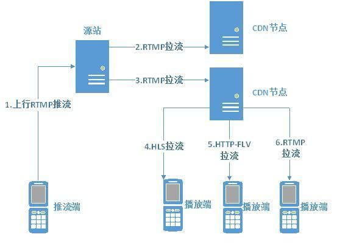

## 推流和拉流


### 推流
#### 什么是推流
推流是把采集阶段封包好的内容传输到服务器的过程，比如在srs流媒体服务器中，使用ffmpeg命令行工具进行推流，推流命令如下：
```shell
ffmpeg -re -i ./doc/source.flv -c copy -f flv rtmp://localhost/live/livestream
```
其实就是将现场的视频信号传到网络的过程。

“推流”对网络要求比较高，如果网络不稳定，直播效果就会很差，观众观看直播时就会发生卡顿等现象，观看体验很是糟糕。
要想用于推流还必须把音视频数据使用传输协议进行封装，变成[流数据(Stream Data)](./流数据.md)。常用的流传输协议有[RTSP](./rtmp协议.md)、RTMP、HLS、DASH等。

使用RTMP传输的延时通常在1�C3秒，对于手机直播这种实时性要求非常高的场景，RTMP也成为手机直播中最常用的流传输协议。最后通过一定的Qos算法将音视频流数据推送到网络断，通过CDN进行分发。

直播中使用广泛的“推流协议”一般是RTMP（Real Time Messaging Protocol――实时消息传输协议）。该协议是一个基于TCP的协议族，是一种设计用来进行实时数据通信的网络协议，主要用来在Flash/AIR平台和支持RTMP协议的流媒体/交互服务器之间进行音视频和数据通信。支持该协议的软件包括Adobe Media Server/Ultrant Media Server/red5等。

### 拉流
#### 什么是拉流
拉流是指服务器已有直播内容，根据协议类型（如RTMP、RTP、[RTSP](./rtmp协议.md)、HTTP等），与服务器建立连接并接收数据，进行拉取的过程。拉流端的核心处理在播放器端的解码和渲染，在互动直播中还需集成聊天室、点赞和礼物系统等功能。

拉流端现在支持RTMP、HLS、HDL（HTTP-FLV）三种协议：

* RTMP是Adobe的专利协议，开源软件和开源库都支持的比较好，延时一般在1-3秒。

* HLS是苹果提出的基于HTTP的流媒体传输协议，优先是跨平台性比较好，HTML5可以直接打开播放，移动端兼容性良好，但是缺点是延迟比较高。

* 对于HDL协议，在在网络稳定的情况下，延时控制可达1s，完全满足互动直播的业务需求。